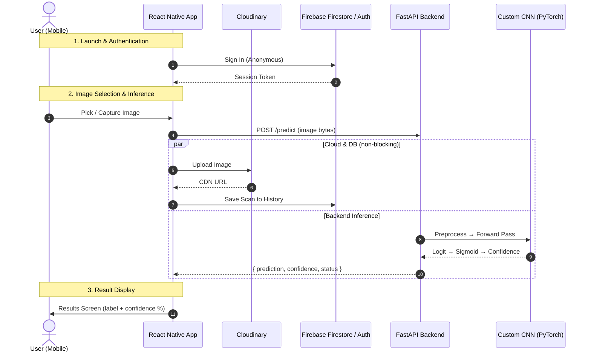

# Deep-Detect 🔍🤖
### Deep-Fake vs. Real Image Classifier — End-to-End Mobile System

Deep-Detect is a professional-grade, full-stack computer vision application that classifies images as **Deep-Fake** or **Real** using a custom-trained PyTorch CNN model. It consists of a FastAPI backend, a cross-platform React Native mobile client, and a standalone desktop utility.

---

## 📁 Repository Structure

```
Deep-Detect/
├── Image_Detector/              # 🐍 Python FastAPI Backend
│   ├── app.py                   # FastAPI server entry point
│   ├── inference.py             # PyTorch model inference pipeline
│   ├── model.py                 # Custom CNN architecture definition
│   ├── predict.py               # Standalone desktop Tkinter utility
│   ├── requirements.txt         # Python dependencies
│   ├── models/                  # Trained model weights (gitignored — see note below)
│   │   └── custom_cnn_standalone.pt
│   └── notebooks/               # Jupyter notebooks (training, evaluation)
│       ├── Model_training.ipynb
│       ├── Model_evaluation.ipynb
│       ├── Preprocessing.ipynb
│       └── Pretrained_Models.ipynb
│
├── DeepDetectMobile/            # 📱 React Native Mobile App (TypeScript)
│   ├── src/
│   │   ├── screens/             # App screens (Home, Results, History, Settings…)
│   │   ├── route/               # Navigation stack (AppNavigator)
│   │   ├── components/          # Reusable UI components
│   │   ├── services/            # API service layer (Axios)
│   │   ├── store/               # Redux state management
│   │   ├── hooks/               # Custom React hooks
│   │   ├── config/              # Backend URL configuration
│   │   │   └── config.ts        # ← Edit BASE_URL here before running
│   │   ├── constants/           # App-wide constants
│   │   ├── assets/              # Images, fonts, SVG icons
│   │   └── utils/               # Utility functions
│   ├── android/                 # Android platform code
│   ├── App.tsx                  # Root application component
│   ├── index.js                 # App entry point
│   └── package.json             # Node dependencies
│
└── docs/                        # 📖 Project documentation
    ├── run_guide.md             # Step-by-step execution guide
    └── commands.md              # Quick command reference
```

> **⚠️ Model Weights:** `custom_cnn_standalone.pt` (~103 MB) is excluded from git due to GitHub's 100 MB file size limit. Download it from the [Releases](../../releases) page or contact the project maintainer.

---

## 🌟 Key Features

- **Custom CNN Architecture** — High-accuracy binary classifier trained from scratch on deep-fake/deepfake datasets
- **FastAPI Backend** — Production-ready async Python server using PyTorch + Uvicorn
- **React Native Mobile App** — Cross-platform (Android/iOS) with Redux, Firebase Firestore history, and fluid UI animations
- **Firebase Integration** — Anonymous authentication and scan history persisted to Firestore
- **Cloudinary Storage** — Uploaded images stored via CDN URL
- **Desktop Utility** — Tkinter GUI for local offline inference without the server

---

## 🏗️ System Architecture



---

## ⚙️ Backend Setup (`Image_Detector/`)

### Prerequisites
- Python 3.10+
- pip

### Installation

```bash
# 1. Navigate to the backend directory
cd Image_Detector

# 2. Create and activate a virtual environment
python -m venv venv

# Windows (PowerShell)
.\venv\Scripts\activate

# macOS / Linux
source venv/bin/activate

# 3. Install dependencies
pip install -r requirements.txt
```

### Place the Model File

Download `custom_cnn_standalone.pt` from the [Releases](../../releases) page and place it at:
```
Image_Detector/models/custom_cnn_standalone.pt
```

### Start the Server

```bash
python app.py
```

Expected output:
```
INFO:inference:Using device: cpu for inference.
INFO:inference:Model loaded successfully and set to evaluation mode.
INFO:deep-detect-api:Starting Deep-Detect backend server...
INFO:     Uvicorn running on http://0.0.0.0:8000 (Press CTRL+C to quit)
```

---

## 📱 Mobile App Setup (`DeepDetectMobile/`)

### Prerequisites
- Node.js v22+
- npm
- Android Studio (with Android SDK installed)
- A physical Android device with **USB Debugging enabled**

### ⚠️ Windows Users — Important Path Note

Due to Windows' 260-character `MAX_PATH` limit, the React Native build **will fail** if the project lives in a deep OneDrive/Desktop path. Before running, copy the project to a short root path:

```powershell
# Copy to a short path to avoid build errors
Copy-Item "C:\path\to\Deep-Detect" "C:\DD" -Recurse
cd C:\DD\DeepDetectMobile
npm install
```

All subsequent mobile commands should be run from `C:\DD\DeepDetectMobile`.

### Android SDK Environment Variables

After installing Android Studio, set these permanently (or prefix each session):

```powershell
$env:ANDROID_HOME = "C:\Users\<YourUser>\AppData\Local\Android\Sdk"
$env:PATH = "$env:PATH;$env:ANDROID_HOME\platform-tools"
```

### Installation

```bash
cd DeepDetectMobile   # or C:\DD\DeepDetectMobile on Windows
npm install
```

### Step 1 — Configure Backend URL

Open [`DeepDetectMobile/src/config/config.ts`](DeepDetectMobile/src/config/config.ts) and set `BASE_URL` to your backend:

**Option A — Same Wi-Fi Network (recommended):**
```typescript
// Find your PC's local IP: run `ipconfig` → look for IPv4 Address
export const BASE_URL = "http://192.168.x.x:8000";
export const END_POINT = "/predict";
```

**Option B — Public Tunnel via Ngrok (different networks):**
```bash
ngrok http 8000
```
```typescript
export const BASE_URL = "https://xxxx-xxxx.ngrok-free.dev";
export const END_POINT = "/predict";
```

### Step 2 — Start Metro Bundler

```bash
npm start
# First time or after moving project: clear cache
npx react-native start --reset-cache
```

### Step 3 — Build & Install on Device

In a separate terminal:

```powershell
# Android
$env:ANDROID_HOME = "C:\Users\<YourUser>\AppData\Local\Android\Sdk"
$env:PATH = "$env:PATH;$env:ANDROID_HOME\platform-tools"
npm run android

# iOS (macOS only)
cd ios && bundle exec pod install && cd ..
npm run ios
```

> The app will be compiled and automatically installed on your connected device.

---

## 🔌 API Reference

### `GET /` — Health Check

```json
{
  "status": "healthy",
  "api_name": "Deep-Detect Image Classification Service",
  "model_architecture": "Custom CNN Standalone (PyTorch)",
  "device_running": "cpu",
  "endpoints": {
    "health_check": "/",
    "inference": "/predict"
  }
}
```

### `POST /predict` — Image Classification

**Request:** `multipart/form-data` with field `file` (JPEG or PNG image)

**Response (Success `200`):**
```json
{
  "prediction": "ai",
  "confidence": 94.85,
  "status": "success"
}
```

**Response (Bad Request `400`):**
```json
{
  "detail": "Uploaded file must be a valid JPEG or PNG image."
}
```

**Response (Server Error `500`):**
```json
{
  "status": "error",
  "message": "Internal error processing the image.",
  "details": "..."
}
```

---

## 🖥️ Desktop Utility

Run standalone local inference without the API server using the Tkinter GUI:

```bash
cd Image_Detector
python predict.py
```

---

## 🛠️ Troubleshooting

| Problem | Solution |
|---|---|
| `SDK location not found` | Create `android/local.properties` with `sdk.dir=C\:\\Users\\...\\Android\\Sdk` |
| `adb not recognized` | Add `%ANDROID_HOME%\platform-tools` to your system PATH |
| `Filename longer than 260 characters` (Windows) | Move project to `C:\DD\` — see Windows note above |
| `NDK did not have a source.properties file` | Open Android Studio → SDK Manager → SDK Tools → reinstall NDK (Side by side) |
| `Cannot connect to dev server` on phone | Shake phone → Dev Settings → set host to your PC's IP:8081 |
| `Module not found` after moving project | Run `npx react-native start --reset-cache` to clear Metro cache |

---

## 📖 Further Documentation

- **[Run Guide](docs/run_guide.md)** — Complete step-by-step execution walkthrough
- **[Command Reference](docs/commands.md)** — Quick-copy terminal commands
- **[Backend README](Image_Detector/README.md)** — Backend-specific details and notebook descriptions

---

## 🧰 Tech Stack

| Layer | Technology |
|---|---|
| Mobile Frontend | React Native 0.86 (TypeScript) |
| State Management | Redux Toolkit |
| Navigation | React Navigation v7 (Stack) |
| Backend API | FastAPI + Uvicorn |
| ML Framework | PyTorch (TorchScript) |
| Auth & Database | Firebase Auth + Firestore |
| Image Storage | Cloudinary |
| HTTP Client | Axios |
