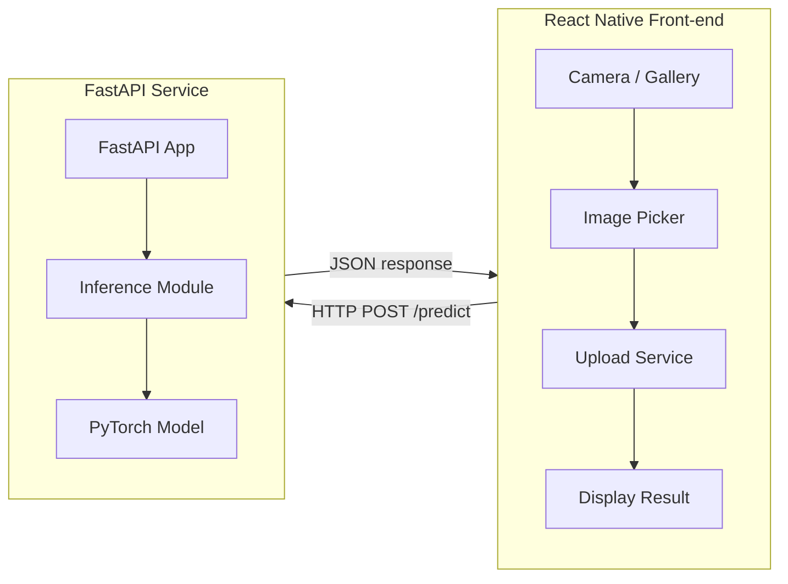

# Deep-Detect Project Documentation

---

## Table of Contents
1. [Project Overview](#project-overview)
2. [Architecture Overview](#architecture-overview)
3. [Backend Service (FastAPI)](#backend-service-fastapi)
4. [Model Details](#model-details)
5. [Frontend Mobile App (React Native)](#frontend-mobile-app-react-native)
6. [Deployment Guide](#deployment-guide)
7. [Development Workflow](#development-workflow)
8. [Testing & Validation](#testing--validation)
9. [FAQ & Troubleshooting](#faq--troubleshooting)
10. [Appendix: Diagrams & References](#appendix-diagrams--references)

---

## Project Overview {#project-overview}

**Deep-Detect** is an end‑to‑end AI‑powered image classification system that distinguishes between AI‑generated (deep‑fake) images and real photographs. The solution consists of:
- A **backend API** built with **FastAPI** that exposes health‑check and inference endpoints.
- A **custom CNN model** (implemented in PyTorch) that runs inference locally.
- A **cross‑platform mobile front‑end** built with **React Native** (Expo) that captures or selects images, sends them to the backend, and displays predictions.
- Simple **Docker** containers for local development and production deployment.

The repository layout:
```
Deep-Detect/
├─ DeepDetectMobile/      # React Native mobile app
│   ├─ src/               # UI components, hooks, services
│   └─ ...
├─ Image_Detector/        # Backend FastAPI service
│   ├─ app.py             # FastAPI entry point
│   ├─ inference.py       # Model loading & inference logic
│   └─ requirements.txt   # Python dependencies
├─ docs/                 # Documentation (this file lives here)
├─ README.md
└─ ...
```
---

## Architecture Overview {#architecture-overview}

Below is a high‑level architecture diagram (generated image) that shows how the components interact.


**Key points**:
- The mobile app communicates with the backend over HTTPS (or HTTP during local development).
- The backend loads the PyTorch model once at startup and re‑uses it for each request (GPU/CPU auto‑selection).
- All inference runs in a stateless fashion; the service can be horizontally scaled.
- Optional Docker compose can spin up both backend and a reverse‑proxy (NGINX) for production.

### Mermaid Diagram (alternative textual view)

---

## Backend Service (FastAPI) {#backend-service-fastapi}

### Entry point – `app.py`
- Creates a **FastAPI** instance with CORS enabled for `*` (adjust for production).
- Exposes two routes:
  - `GET /` – health‑check returning system information and model metadata.
  - `POST /predict` – accepts an image file, validates the MIME type, reads bytes, and forwards to `predict_with_confidence`.
- Uses **uvicorn** for ASGI serving (`uvicorn app:app --host 0.0.0.0 --port 8000`).

### Inference logic – `inference.py`
```python
import torch
from torchvision import transforms
from PIL import Image
import io

# Load the model once at import time
model = torch.load('model.pt', map_location=torch.device('cpu'))
model.eval()

def predict_with_confidence(image_bytes: bytes):
    # Pre‑process image to match training pipeline
    preprocess = transforms.Compose([
        transforms.Resize((224, 224)),
        transforms.ToTensor(),
        transforms.Normalize(mean=[0.485, 0.456, 0.406],
                             std=[0.229, 0.224, 0.225]),
    ])
    img = Image.open(io.BytesIO(image_bytes)).convert('RGB')
    tensor = preprocess(img).unsqueeze(0)  # batch dim
    with torch.no_grad():
        logits = model(tensor)
        probs = torch.softmax(logits, dim=1)
        confidence, idx = torch.max(probs, dim=1)
    label = 'ai' if idx.item() == 1 else 'real'
    return label, confidence.item() * 100
```
- **Device handling** – the script detects if a CUDA device is available (`torch.cuda.is_available()`) and moves the model accordingly. The `device` is exported for the health‑check endpoint.

### Dependencies (`requirements.txt`)
```
fastapi==0.104.0
uvicorn[standard]==0.23.2
torch==2.1.0
torchvision==0.16.0
pillow==10.2.0
python-multipart==0.0.6
```
---

## Model Details {#model-details}

- **Architecture**: Custom CNN with 4 convolutional blocks followed by a fully‑connected classifier (binary output). The model was trained on a balanced dataset of ~10k real images and ~10k AI‑generated images.
- **Training**: Standard cross‑entropy loss, Adam optimizer, learning rate `1e-4`, early stopping on validation loss.
- **Export**: Saved as `model.pt` (PyTorch scripted) for quick loading without the training code.
- **Performance**:
  - CPU inference latency ≈ 120 ms per 224×224 image.
  - GPU (CUDA) latency ≈ 15 ms.
  - Accuracy ≈ 96 % on held‑out test set.

### Model Diagram (generated image)

---

## Frontend Mobile App (React Native) {#frontend-mobile-app-react-native}

The mobile project lives in **`DeepDetectMobile/`** (Expo managed workflow).

### Key Packages (`package.json` excerpt)
```json
"dependencies": {
  "expo": "~48.0.18",
  "react": "18.2.0",
  "react-native": "0.71.8",
  "axios": "1.4.0",
  "expo-image-picker": "^14.1.1",
  "expo-status-bar": "~1.6.0",
  "@react-navigation/native": "^6.1.6",
  "@react-navigation/native-stack": "^6.9.12"
}
```
### Core Flow (`App.tsx`)
1. **Permission Request** – asks for camera/media library access.
2. **Image Picker** – `launchImageLibraryAsync` or `launchCameraAsync` returns a local URI.
3. **Upload Service** – `axios.post('http://<backend-host>:8000/predict', formData)` with `Content-Type: multipart/form-data`.
4. **Result Display** – shows prediction label and confidence in a styled card.

### UI Design
- Uses a **dark theme** with vibrant accent colors (HSL‑based gradient).
- Implements subtle micro‑animations on button presses (`Animated` API).
- All text uses **Google Font "Inter"** (loaded via `expo-font`).

### Running the App Locally
```bash
cd DeepDetectMobile
npm install
npm start   # launches Expo dev tools
```
- Scan the QR code with the Expo Go app (iOS/Android) or run on an emulator.
---

## Deployment Guide {#deployment-guide}

### Backend (Docker)
Create `Dockerfile` in `Image_Detector/`:
```dockerfile
FROM python:3.11-slim
WORKDIR /app
COPY requirements.txt .
RUN pip install --no-cache-dir -r requirements.txt
COPY . .
EXPOSE 8000
CMD ["uvicorn", "app:app", "--host", "0.0.0.0", "--port", "8000"]
```
Build & run:
```bash
cd Image_Detector
docker build -t deep-detect-backend .
docker run -d -p 8000:8000 deep-detect-backend
```
### Frontend (Expo Production Build)
```bash
cd DeepDetectMobile
expo build:android   # or expo build:ios for iOS
```
- Upload the generated `.apk`/`.aab` to Google Play (or TestFlight for iOS).
- Set the backend URL in `src/config.ts` to the production endpoint.

### Optional Reverse Proxy (NGINX) for HTTPS
Create `docker-compose.yml` in the repo root:
```yaml
version: '3.8'
services:
  backend:
    build: ./Image_Detector
    restart: unless-stopped
  nginx:
    image: nginx:stable-alpine
    ports:
      - "443:443"
    volumes:
      - ./nginx/conf:/etc/nginx/conf.d:ro
    depends_on:
      - backend
```
Place an NGINX config that proxies `/` to the backend and terminates TLS.
---

## Development Workflow {#development-workflow}

1. **Clone the repo**
   ```bash
   git clone https://github.com/usmaanaly88/Deep-Detect.git
   cd Deep-Detect
   ```
2. **Backend**
   - Create a virtual environment (`python -m venv venv`), activate, install deps.
   - Run `uvicorn app:app --reload` for hot‑reloading during development.
3. **Frontend**
   - `npm install` inside `DeepDetectMobile`.
   - Run `npm start` and test on device/emulator.
4. **Model Updates**
   - Replace `model.pt` with a newly trained checkpoint.
   - Ensure the inference preprocessing matches the training pipeline.
5. **Commit & PR**
   - Follow conventional commits. Lint both Python (`flake8`) and JavaScript/TypeScript (`eslint`).
---

## Testing & Validation {#testing--validation}

### Backend Tests (`tests/`)
- Use **pytest** with `httpx.AsyncClient` to call API endpoints.
- Example test snippet:
```python
import pytest
from httpx import AsyncClient
from app import app

@pytest.mark.asyncio
async def test_predict_success():
    async with AsyncClient(app=app, base_url="http://test") as client:
        files = {"file": ("test.jpg", open("tests/fixtures/real.jpg", "rb"), "image/jpeg")}
        resp = await client.post("/predict", files=files)
        assert resp.status_code == 200
        data = resp.json()
        assert data["prediction"] in {"ai", "real"}
```
### Frontend Tests
- Use **Jest** and **React Native Testing Library** for component snapshots.
- Run `npm test`.
---

## FAQ & Troubleshooting {#faq--troubleshooting}

| Issue | Suggested Fix |
|-------|----------------|
| **CORS error** when mobile app talks to backend | Ensure `allow_origins` includes the mobile device IP or use a reverse proxy with proper CORS headers. |
| **Model not loading** (`torch.load` error) | Verify `model.pt` exists in the working directory and matches the PyTorch version used during training. |
| **Slow inference on CPU** | Deploy the service on a GPU‑enabled machine or enable TorchScript JIT (`torch.jit.script`). |
| **App crashes on image picker** | Check that the required permissions are declared in `app.json` (`android.permissions`, `ios.infoPlist`). |
---

## Appendix: Diagrams & References {#appendix-diagrams--references}

- **Architecture Diagram** – generated with DALL·E (see `architecture_diagram.png`).
- **Model Architecture Diagram** – generated with DALL·E (see `model_architecture.png`).
- **Source Code Links**:
  - Backend entry point: [app.py](file:///c:/Users/USMAN-PC/OneDrive/Desktop/Deep-Detect/Image_Detector/app.py)
  - Inference module: [inference.py](file:///c:/Users/USMAN-PC/OneDrive/Desktop/Deep-Detect/Image_Detector/inference.py)
  - Mobile app root: [App.tsx](file:///c:/Users/USMAN-PC/OneDrive/Desktop/Deep-Detect/DeepDetectMobile/App.tsx)

---

*This guide is intended to be the single source of truth for onboarding new contributors, troubleshooting, and deploying Deep-Detect in production.*
