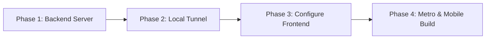

# End-to-End System Execution Guide 🚀📱

This guide contains the exact step-by-step commands and procedures to run the **Deep-Detect** backend and connect the **React Native** mobile client to it on your physical mobile phone.

---

## 🗲 Execution Workflow Checklist

Follow these phases in order:



---

## 📂 Phase 1: Start the PyTorch Backend

1. Open a new terminal window on your computer and navigate to the `Image_Detector` folder:
   ```bash
   cd c:\Users\USMAN-PC\OneDrive\Desktop\Deep-Detect\Image_Detector
   ```

2. Activate the Python virtual environment:
   * **Windows (PowerShell)**:
     ```powershell
     .\venv\Scripts\activate
     ```
   * **macOS / Linux**:
     ```bash
     source venv/bin/activate
     ```

3. Launch the FastAPI server:
   ```bash
   python app.py
   ```
   > [!NOTE]
   > You should see logs indicating the model successfully loaded and that the server is running on `http://0.0.0.0:8000`:
   > ```text
   > INFO:inference:Using device: cpu for inference.
   > INFO:inference:Loading TorchScript model from c:\Users\USMAN-PC\OneDrive\Desktop\Deep-Detect\Image_Detector\models\custom_cnn_standalone.pt...
   > INFO:inference:Model loaded successfully and set to evaluation mode.
   > INFO:deep-detect-api:Starting Deep-Detect backend server...
   > INFO:  Uvicorn running on http://0.0.0.0:8000 (Press CTRL+C to quit)
   > ```

---

## 🌐 Phase 2: Expose Your Backend Server to Your Phone

Since your mobile phone cannot access `localhost` directly, you need to route the requests. Choose **one** of the two options below:

### 📶 Option A: Same Wi-Fi Network (Recommended - Zero Installation)
If both your computer and your mobile phone are connected to the **same Wi-Fi network**:
1. Your computer's current Wi-Fi IP address has been detected as: **`10.133.99.87`**
2. Proceed to **Phase 3** and configure this IP directly. No extra tools are needed!

### 🌍 Option B: Using a Public Tunnel (Ngrok)
If you are on different networks, or if your router blocks local device communication, you can use `ngrok`:
1. If you haven't installed ngrok, download it from [ngrok.com](https://ngrok.com/download), extract it, and add it to your System PATH (or run it using its full file path).
2. Open a **second** terminal window and start the tunnel:
   ```bash
   ngrok http 8000
   ```
3. Copy the generated public HTTPS URL (e.g., `https://xxxx-xxxx.ngrok-free.dev`).

---

## ⚙️ Phase 3: Configure the Mobile Frontend

1. Open the file [config.ts](file:///c:/Users/USMAN-PC/OneDrive/Desktop/Deep-Detect/DeepDetectMobile/src/config/config.ts) in your editor.
2. Configure the `BASE_URL` depending on the option you selected in Phase 2:
   * **If using Option A (Wi-Fi)**:
     ```typescript
     export const BASE_URL = "http://10.133.99.87:8000"
     ```
   * **If using Option B (Ngrok)**:
     ```typescript
     export const BASE_URL = "https://xxxx-xxxx.ngrok-free.dev" // Your ngrok HTTPS URL
     ```
3. Keep the `END_POINT` unchanged:
   ```typescript
   export const END_POINT = "/predict"
   ```
4. Save the file.

---

## 📲 Phase 4: Run the App on Your Mobile Phone

### 1. Connect and Enable Debugging on Your Phone
* **Android**:
  1. Open **Settings** > **About Phone**.
  2. Tap **Build Number** 7 times to enable Developer Mode.
  3. Go to **Settings** > **System** > **Developer Options**, and turn on **USB Debugging**.
  4. Connect your phone to your computer via USB. A prompt may appear asking to "Allow USB debugging". Select **Allow**.
* **iOS (macOS only)**:
  1. Connect your iPhone via USB.
  2. Open **Settings** > **Privacy & Security** > scroll to **Developer Mode** and turn it on. Follow prompts to restart the device.

### 2. Start the Metro Bundler
Open a **third** terminal window and navigate to the mobile app folder:
```bash
cd c:\Users\USMAN-PC\OneDrive\Desktop\Deep-Detect\DeepDetectMobile
```
Launch Metro:
```bash
npm start
```

### 3. Deploy the App to Your Device
Open a **fourth** terminal window, navigate to `DeepDetectMobile` and run the build:
* **For Android physical device**:
  ```bash
  npm run android
  ```
* **For iOS physical device** (requires macOS & Xcode):
  ```bash
  cd ios
  bundle exec pod install
  cd ..
  npm run ios
  ```

Once compiled, the app will install on your phone and open automatically.

---

## 🛠️ Connection Troubleshooting

If the app fails to connect or shows a network error:

1. **Verify Wi-Fi Connection**: Make sure your phone and your computer are connected to the exact same Wi-Fi network.
2. **Test API on Your Phone**: Open Chrome or Safari on your mobile phone, and visit:
   `http://10.133.99.87:8000/`
   * If it loads the API health check JSON (`{"status":"healthy",...}`), the connection is working perfectly!
   * If it doesn't load, Windows Firewall might be blocking incoming connections on port 8000.
3. **Configure Windows Firewall (If blocked)**:
   * Open **Windows Defender Firewall** > click **Advanced Settings**.
   * In the left panel, click **Inbound Rules** > in the right panel, click **New Rule...**
   * Choose **Port** > click **Next** > enter `8000` in **Specific local ports** > click **Next**.
   * Choose **Allow the connection** > click **Next** > check all profiles (Domain, Private, Public) > click **Next**.
   * Name the rule (e.g. `FastAPI Port 8000`) and click **Finish**.
4. **USB Mode**: If your device is not listed when running `npm run android`, make sure USB debugging is on, and change your phone's USB configuration from "Charging Only" to "File Transfer (MTP)".


